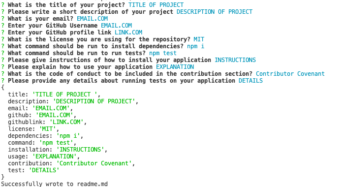
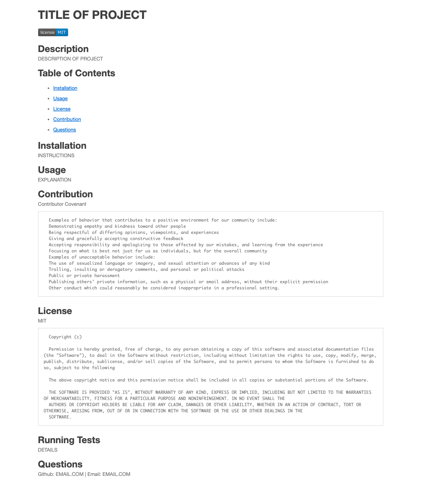

# ReadMe Generator 

## Description
Please see link to the demonstration video for deployment uploaded separately. 

## Running the Application 
The index.js file was run through the integrated terminal on mac and the prompts were filled out as shown below:

     

## ReadMe
This is a screenshot of the generated ReadMe in preview mode. 

     

